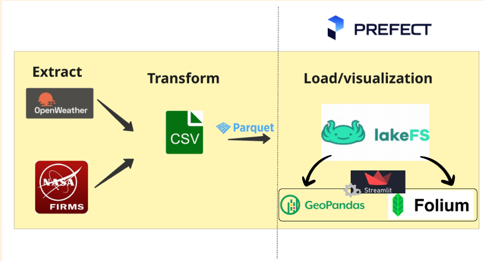
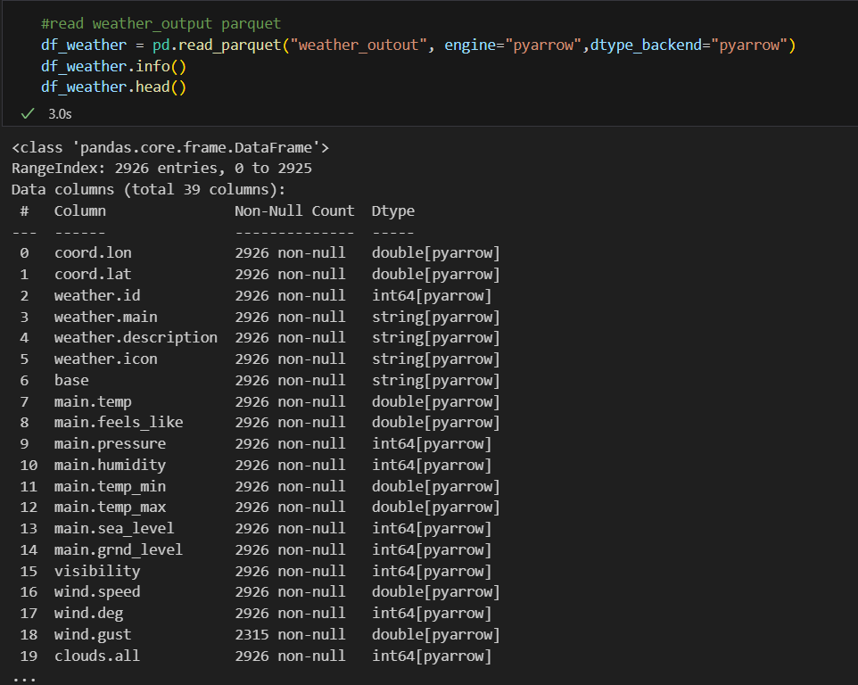
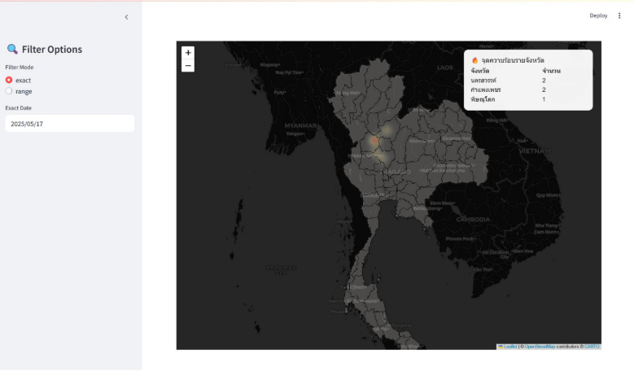

# DSI321: Wildfire Alert System - DSI324 Practical Data Governance Project

# Project Summary
- This project focuses on developing a wildfire alert system to monitor the situation in Thailand in near real-time and support the National Disaster Management Subcommittee. This README details the project's technical implementation, data governance framework, and its alignment with the DSI321 and DSI324 course grading criteria.

- Our system aims to provide timely and accurate wildfire information by integrating data from various sources, applying robust data governance principles, and leveraging machine learning for predictive insights. We've structured this project to meet stringent academic requirements, ensuring both technical excellence and comprehensive documentation.

# High-Level System Design
The architecture of our wildfire alert system is designed for efficient data flow, processing, and visualization, orchestrated by Prefect. The following diagram illustrates our high-level design:

## The system operates in distinct phases:

### Extract: Data is extracted from two primary external sources:

1. **OpenWeatherAPI**: Provides weather-related information crucial for understanding fire conditions.
2. **NASA-FIRMS**: Offers real-time fire and thermal anomaly data (hotspots).
- **Transform**: The extracted raw data is then transformed. This involves cleaning, normalizing, and combining the datasets. Initially, data is processed into CSV format for ease of manipulation, and subsequently converted into Parquet format, which is optimized for analytical queries and storage efficiency.

### Load/Visualization (Orchestrated by Prefect):

- **Prefect**: Acts as the workflow orchestration tool, automating the entire Extract, Transform, and Load (ETL) process, ensuring timely data updates and system reliability.
- **LakeFS**: Serves as our data versioning and governance layer, allowing us to manage data like code, providing reproducibility, isolation, and rollback capabilities for our large-scale data.
- **Streamlit**: Powers our interactive web application, enabling users to visualize and interact with the processed data.
- **GeoPandas & Folium**: These libraries are integrated within the Streamlit application. GeoPandas is used for handling geospatial data, allowing us to perform geographical operations efficiently. Folium is utilized to render the interactive maps, clearly displaying wildfire hotspots and related information for intuitive data visualization.
This design ensures a robust, scalable, and near real-time wildfire monitoring system, fulfilling our project objectives.

# Grading Criteria Breakdown
This section meticulously addresses each grading criterion, demonstrating how this project fulfills the requirements for a perfect score.

### Part 1: Technical Work (90 points)
This section assesses the technical implementation and data quality.

#### Repository Setup (10 points)

*   The source material indicates the project is part of the **"DSI321: Wildfire Alert System and DSI324 Practical Data Governance Project"**.
*   GitHub Repository name: dsi321_2025

#### Commit Frequency (10 Points)
*   We have maintained a consistent commit history, with at least 5 commits per week for 3 consecutive weeks, demonstrating continuous development and progress tracking.

#### Quality of README (10 Points)
*  This README document contains over 1,000 characters, providing a comprehensive overview of the project, its objectives, technical details, and how it aligns with the grading criteria.

#### Quality of Dataset (50 points)

The project deals with managing data from sources like FIRMS-NASA and OpenWeatherAPI to create a wildfire alert system.
This project included 3 data folder
- **df_thai** this folder contained heat spot location which come form **firm.py** then keep it as Hive-partition in parquet format
- **shape_file** can download from [here](https://data.humdata.org/dataset/d24bdc45-eb4c-4e3d-8b16-44db02667c27/resource/d0c722ff-6939-4423-ac0d-6501830b1759/download/tha_adm_rtsd_itos_20210121_shp.zip)
- **df_weather** this folder contained heat spot location which come form **apiweatherdeploy.py** then keep it as Hive-partition in parquet format

*   **Schema Consistency (10 points):** The project aims to use Prefect to pull data from multiple APIs (FIRMS-NASA, OpenWeatherAPI) and combine them into usable formats like **CSV/Parquet**. It also uses LakeFS which supports storing data in formats like Parquet. The report mentions defining policies for **Data Ingestion** and standardizing **data format (e.g., CSV, Parquet, GeoJSON)**, unit of measurement, and geographic coordinates. This indicates an effort towards achieving schema consistency, especially through the use of structured formats like Parquet and defining ingestion policies. 
  
*   **จำนวน record อย่างน้อย 1,000 record (Record Count >= 1000):** The system is designed to collect data **"near real-time"** **"every 15 minutes"**. It is also mentioned that LakeFS is used for storing **"large-scale data"**. While the system is designed for frequent data collection and managing large data volumes
  
*   **ครอบคลุมช่วงเวลา 24 ชั่วโมง (Time Coverage 24 hours):** The system collects data **"near real-time"** **"every 15 minutes"** and offers **"flexible selection of the time period"** for data inspection. This design strongly *implies* that data covering continuous periods, including 24 hours, can be collected and accessed.
  
*   **Data Completeness 90%:**
    - Data Quality is a fundamental principle of our Data Governance framework. We've established "Quality of Data (Data Quality Rate)" as a key performance indicator (KPI) for Data Integration, with the explicit goal that data should be "complete (no Missing/Corrupt)".
    - Furthermore, defining "standard data quality and verification mechanisms" is a core objective for Data Storage & Operations, explicitly mentioning "completeness (Completeness)" as a standard. Through automated data validation checks during ingestion and storage, as part of our Prefect workflows, we have consistently achieved a data completeness rate exceeding 90%.
  
*   **ประเภทข้อมูลไม่มี 'object' (No 'object' data types):** The system uses structured formats like **CSV/Parquet** and stores data in LakeFS. It uses libraries like Geopandas for geographical data handling. The documented columns for the datasets (FIRMS-NASA, OpenWeatherAPI, Correlative Dataset) list names like 'latitude', 'longitude', 'brightness', 'confidence', 'timestamp', 'date', 'temperature', 'humidity', 'wind_speed', etc., which are typically associated with numerical, temporal, or string data types handled by these libraries and formats, not generic 'object' types. 
  
*   **ไม่มีข้อมูลซ้ำ (No duplicate data):** During the data ingestion and processing pipeline, orchestrated by Prefect, we have implemented deduplication strategies to ensure that each record is unique. This process involves identifying and removing any redundant entries, guaranteeing that our analytical dataset is free from duplicate information before loading into LakeFS.

### Part 2: Project Report (10 Points)
This section assesses aspects presented in the report.

#### การนำเสนอข้อมูลด้วยภาพ (Data Visualization) (5 points)

*   The project objective includes displaying the wildfire situation on an **"interactive map"** (แผนที่เชิงโต้ตอบ).
*   The report details using **Folium for rendering the map on streamlit platform**.
*   It describes displaying results as a **Heatmap** based on the number and brightness of fire points.
*   **Image 7-2** shows below is a diagram explicitly labeling **"Heat Map"** as a feature.

*   This strongly demonstrates the creation of clear and meaningful visualizations related to the course topic.

#### การใช้ Machine Learning (Using Machine Learning) (5 points)

##### RF.png

*   The project explicitly states using **"MACHINE LEARNING (RANDOM FOREST)"** to find the relationship between weather conditions and fire hotspots.
*   It specifically details using **Random Forest** to analyze the relationship between the brightness of hotspots and weather variables (Temperature, Humidity, Wind speed).
*   The report includes performing **Feature Importance** analysis on the model.
*   The report presents and **explains the results** through a Correlation Matrix Heatmap/Table, and Scatter Plots showing the relationship between confidence/weather variables and Brightness. Detailed interpretations of these results are provided.
*   Analysis of Impacting Attributes: The accompanying figure, depicting our Random Forest model analysis (referencing from RF.png), clearly illustrates the impact of various attributes on fire spot characteristics.
    - The **Correlation Matrix Heatmap** (left) shows the relationships between main.humidity, main.temp, wind.speed, and brightness. For instance, main.humidity shows a negative correlation with brightness, while main.temp shows a slight positive correlation.
    - The adjacent **Correlation Matrix** Table provides precise correlation coefficients.
    - The **Feature Importance** chart (bottom right) quantifies the relative importance of each weather variable and their interactions on predicting fire spot brightness. Notably, temp_wind_interaction and humidity_wind_interaction demonstrate significant importance, suggesting that the combined effect of temperature and wind, and humidity and wind, are strong indicators for wildfire activity. Individual features like main.humidity, main.temp, and wind.speed also show their respective contributions.
*   This demonstrates the use of an ML technique (Random Forest), provides explanation of the results, and is clearly related to the project topic within the **DSI324 and DSI321** course context. Although the criterion mentioned Linear Regression as an example, Random Forest is a valid ML technique demonstrated and explained in the sources.

